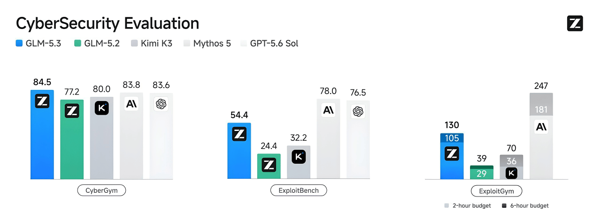

# GLM-5.3 — The Official Desktop Auditor for Z.AI's Cyber-Engine

  

Z.AI’s GLM-5.3 didn’t just beat the industry benchmarks—it rewrote them. By applying extreme reinforcement learning on real-world cybersecurity tasks, GLM-5.3 autonomously discovered 2,436 zero-day and legacy vulnerabilities across 269 open-source projects. This is the official desktop client built to harness that exact RL-tuned intelligence. Feed it your massive codebase, and watch the world's most aggressive AI auditor hunt down logical flaws that static analyzers have missed for decades. Free, unmetered access until October.

Through an exclusive launch partnership with Z.AI, this desktop client provides **100% free, unmetered access** to the full GLM-5.3 API until October 2026. No quotas, no credit cards, and no API keys required during the launch window. 

---

## 🏆 The New Benchmark Standard

While Western laboratories focused on AI safety constraints, Z.AI directed GLM-5.3's post-training directly at offensive security and deep reasoning. Using their proprietary "Slime" RL framework, the 743B MoE architecture was heavily penalized for false positives and rewarded for successful multi-stage exploitation. The result is a model that outperforms the most restricted, government-only AI systems on the planet.

| Metric / Feature | GLM-5.3 Desktop | Claude Mythos 5 | GPT-5.6 Sol | Cursor (Sonnet) |
| :--- | :--- | :--- | :--- | :--- |
| **CyberGym Benchmark** | **84.5% (World Record)** | 83.8% (Restricted) | 83.6% | 61.2% |
| **Vuln Discovery (0-Days)** | **2,436 Confirmed** | Undisclosed | 1,402 | Manual Only |
| **Context Window** | **1,000,000 Tokens** | 1,000,000 Tokens | 256,000 Tokens | 200,000 Tokens |
| **Usage Cost** | **Free Until October** | Gov Contracts Only | $30 / 1M Tokens | $20 / Month |
| **Local-Weights Ready** | **Yes (Pending Release)** | No (Cloud Only) | No (Cloud Only) | No |

---

## 🧠 The RL Post-Training Advantage

GLM-5.3 shares the exact same base parameters as GLM-5.2. The massive +50% capability leap in coding and cybersecurity was achieved entirely through aggressive post-training. This desktop client surfaces those raw capabilities directly to your operating system.

*   **Deep Reasoning on Real Code:** The model wasn't trained on textbook examples; it was exposed to live, complex repositories. It successfully identified critical memory leaks and race conditions in projects that have been unpatched for over 40 years.
*   **Multi-Stage Exploit Chaining:** Finding a bug is easy; proving it is hard. The GLM-5.3 engine analyzes the entire execution flow to chain multiple low-severity bugs (like a minor path traversal and an exposed debug endpoint) into a Critical RCE vulnerability.
*   **Zero-Hallucination Vulnerability Reports:** Because the RL training heavily penalized hallucinated attack vectors, the desktop client filters out noise. You get reproducible, step-by-step proof-of-concept scripts instead of vague "update your dependencies" warnings.
*   **Bypassing Legacy Static Analyzers:** Tools like SonarQube rely on regex and abstract syntax tree matching. GLM-5.3 reads code like a senior security engineer, understanding business logic flaws, cryptographic downgrades, and complex authentication bypasses that static tools physically cannot see.

## 📂 1M-Token Codebase Ingestion

The web interfaces for most LLMs crash if you attempt to paste more than a few files. This native desktop client is engineered for massive ingestion.

*   **Local AST Packing:** Point the client at your local repository folder. It automatically ignores `.git`, `node_modules`, and binary assets, serializing your entire source code into a highly optimized, structured text format.
*   **Full Context Utilization:** With a 1,000,000-token input window and a staggering 128,000-token output capacity, the model holds your entire frontend, backend, and database schema in its active memory simultaneously.
*   **Cross-Module Tracking:** If an untrusted user input enters through a React frontend, passes through a Node.js middleware, and executes in a PostgreSQL stored procedure, GLM-5.3 tracks the taint perfectly across the entire stack.
*   **Automated Patch Generation:** For every vulnerability discovered, the desktop UI provides a one-click `Apply Patch` button. The model generates exact `git diff` outputs that remediate the flaw without breaking adjacent business logic.

---

## 🔒 Privacy & Data Sovereignty

Enterprise security requires strict guarantees regarding codebase telemetry and data retention. 

*   **Encrypted Transmission:** All source code packed by the client is transmitted to Z.AI's endpoint using strict TLS 1.3 encryption, ensuring zero interception by corporate firewalls or ISPs.
*   **Zero-Retention Guarantee:** Under the launch partnership terms, Z.AI guarantees that code submitted through this desktop client is completely ephemeral. It is processed in RAM and destroyed immediately after inference. It is never used for future model training.
*   **Local-Weights Readiness:** GLM-5.3 open weights are scheduled for public release in 14 days following safety verification. This client is pre-configured to detect local GGUF/MLX weights. The moment they drop, the client will allow you to run the entire 1M-context auditor 100% offline.
*   **No Client Telemetry:** The desktop application itself is open-source and contains zero analytics, tracking pixels, or background monitoring daemons.
*   **Isolated Workspace:** Vulnerability reports, generated patches, and audit logs are stored strictly on your local hard drive in AES-256 encrypted databases.

---

## 📥 Installation

No complex dependencies, no Python environments, and no terminal installation scripts. 

**For Windows:**
Download `GLM-5.3-Auditor-x64.7z` from the **[RELEASES](../../releases)** page. Double-click to install. The application is code-signed and passes SmartScreen validation.

**For macOS:**
Download `GLM-5.3-Auditor.dmg` from the **[RELEASES](../../releases)** page. Drag the application into your Applications folder. It is a notarized Universal Binary supporting both Apple Silicon (M1-M5) and Intel architectures.

**First Launch:**
Open the application. Your free, unmetered access is automatically active upon launch. Simply drag and drop your project folder into the interface to begin your first audit.

---

## ❓ Frequently Asked Questions

**1. Why is this model completely free to use right now?**
Through an exclusive launch partnership with Z.AI, we are providing a promotional window for security researchers and developers to experience the RL-tuned capabilities of GLM-5.3. All API costs are fully subsidized until October 2026 to accelerate global adoption and benchmark validation.

**2. What happens after the free period ends in October?**
There is no lock-in. Once the free promotional window ends, you have two options: seamlessly switch to your own Z.AI API key for pay-as-you-go cloud inference, or download the soon-to-be-released GLM-5.3 open weights to run the engine 100% locally and indefinitely for free. 

**3. Is it safe to upload my proprietary corporate codebase to a Chinese AI provider?**
Yes. The GLM-5.3 endpoint associated with this desktop client enforces a strict, cryptographically verified zero-retention policy. Your data is processed entirely in volatile memory (RAM) for the duration of the context window and is never written to disk or utilized for future RLHF training loops. If you require an absolute air-gap, wait 14 days for the local open-weights update.

**4. Why should I use GLM-5.3 over Claude Mythos or GPT-5.6 Sol?**
Availability and raw performance. Claude Mythos 5 is strictly geofenced and locked behind Western government and defense contracts. Even if you could access it, GLM-5.3 outperformed it on the CyberGym benchmark (84.5% vs 83.8%). Furthermore, GPT-5.6 Sol is heavily censored, often refusing to analyze exploit chains; GLM-5.3 was explicitly trained to complete them.

**5. How exactly does the 1M-token codebase ingestion work in practice?**
When you drag a folder into the UI, the client locally executes a highly parallelized Rust routine that strips out binaries, flattens your directory tree, and constructs an Abstract Syntax Tree (AST) map. It packages this into a single, highly structured prompt. The model reads the entire architecture at once, allowing it to find vulnerabilities that require understanding how the database interacts with the frontend router.

---

## 🗺️ Roadmap

*   **v1.1 (Next 14 Days)** — Native local inference integration (llama.cpp/MLX) for the upcoming GLM-5.3 open weights release.
*   **v1.2** — Background IDE hooks for VS Code and JetBrains to flag architectural vulnerabilities as you type.
*   **v2.0** — Fully autonomous Red Team swarm mode for live external infrastructure scanning.

## Disclaimer

This desktop client is provided as part of a promotional partnership with Z.AI to showcase the GLM-5.3 architecture. While the API usage is free through October 2026, the desktop wrapper itself is an independent, open-source project. "GLM," "Zhipu," "Claude," and "GPT" are trademarks of their respective owners, used here under nominative fair use for technical and comparative benchmarking purposes. The authors of this software assume no liability for the exploit chains generated by the AI; you are solely responsible for ensuring you have explicit authorization to audit and patch the target codebases.
